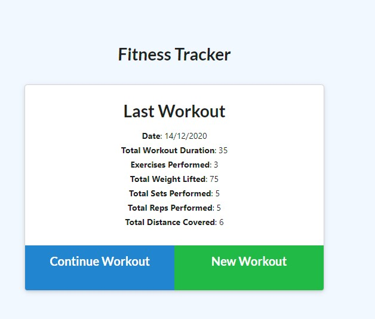
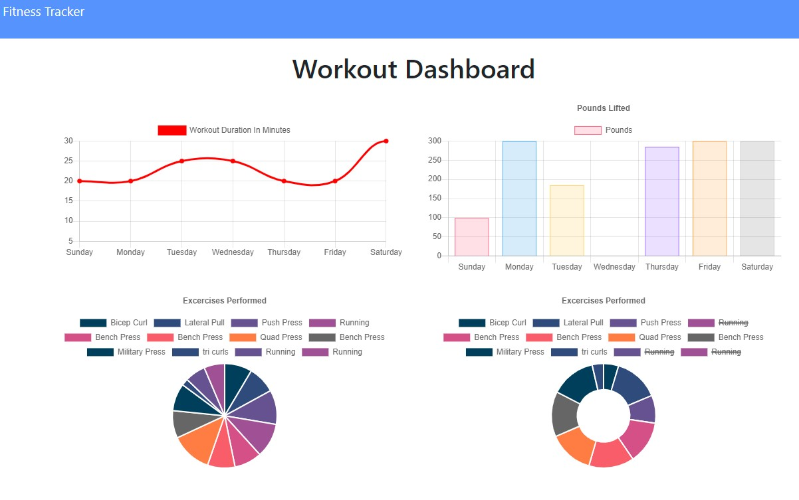

# workout-tracker
Create and track your daily workouts.

## User Story

Given a frontend consisting of 3 html files and associated css and javascript files, the requirement was to provide backend functionality to allow a user to create, modify and view statistics of workouts using the Express framework with Nodejs and MongoDB.

## Built With

- [VScode](https://code.visualstudio.com/) - The editor of choice

#### Initial interface

### Licence

GNU General Public License v3.0

### Link to app on Heroku

<a href="https://limitless-ravine-81223.herokuapp.com">Fitness Tracker</a>

### Link to the github Repo

<a href="https://github.com/galluk/workout-tracker">workout-tracker</a>

## Author

- **Luke Gallagher** -
  luke.gallagher.cst@gmail.com
